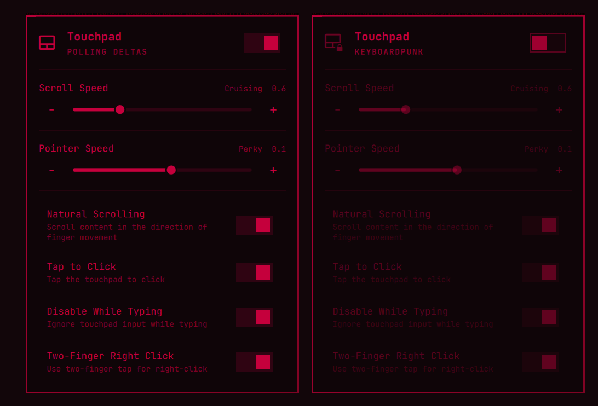

# Touchpad — Omarchy bar widget

A bar widget for [Omarchy](https://omarchy.org)'s Quickshell bar that puts the
common Hyprland touchpad settings behind a single click.




Enabled and disabled. The hero line cycles a phrase every 2.8s; the whole panel
takes its colors from your active Omarchy theme, so yours will not be red unless
you are also running a red one.

In the bar, between the speaker and the display widgets:


## Features

- **Enable / disable** the touchpad
- **Scroll speed** slider (0.1–2.0) with named tiers, adjustable by scroll wheel or drag
- **Pointer speed** slider (−1.0–+1.0), scoped to the touchpad alone
- **Natural scrolling** toggle
- **Tap to click** toggle
- **Disable while typing** toggle
- **Clickfinger behavior** toggle
- Full keyboard cursor navigation across every control
- IPC handlers (`open` / `close` / `toggle` / `show` / `hide`) for keybinds
- Rotating hero status phrases, in the style of the built-in panels

## Status phrases

Like Omarchy's built-in network, bluetooth, and power panels, the hero status
line cycles a phrase every 2.8s while the panel is open, cross-faded rather
than hard-cut. Which set rotates depends on the pad:

| State | Phrases |
| --- | --- |
| Enabled | Tracking fingers, Counting taps, Reading swipes, Sensing capacitance, Herding pixels, Chasing gestures, Smoothing jitter, Polling deltas, Feeling around |
| Disabled | Keyboardpunk, Palms rejected, Homerow purist, Hjkl forever, Sensor napping, Ignoring thumbs, Refusing swipes, Gone tactile |
| No device | `NO DEVICE` (static) |

Edit `enabledPhrases` / `disabledPhrases` near the top of `Panel.qml` to make
them your own.

The scroll speed slider is labeled the same way in spirit, but keyed to the
value rather than a timer -- it updates live as you drag, alongside the number:

| Factor | Label |
| --- | --- |
| 0.1 – 0.2 | Glacial |
| 0.3 – 0.4 | Decaf |
| 0.5 – 0.6 | Cruising |
| 0.7 – 1.0 | Caffeinated |
| 1.1 – 1.5 | Overclocked |
| 1.6 – 2.0 | Ludicrous |

Omarchy's default is `0.4`. Change the tiers in `scrollSpeedLabel()` in `Model.js`.

## Settings persistence

`hyprctl eval` only changes the *running* compositor, and Omarchy's default
`hypr/input.lua` hardcodes `natural_scroll = false` — so the next config reload
(theme switch, saving any `hypr/*.lua`, `hyprctl reload`) would wipe out any
runtime change.

To survive that, every change is also mirrored to:

```
~/.local/state/omarchy/toggles/hypr/touchpad-settings.lua
```

Omarchy's `default/hypr/toggles.lua` re-requires that directory on each reload,
*after* `hypr/input.lua`, so these settings win.

That file is generated, and it is generated as literals: booleans, a clamped
number, and one outside string — the touchpad's device name, needed because
Hyprland has no `input:touchpad:sensitivity` and the setting has to name its
device. That name is filtered before it is ever stored (printable, length
capped) and rendered as an escaped Lua byte string, so it cannot close the
literal it sits in. The file opens nothing and `require`s nothing at reload
time; see [Writing to a predictable path
safely](#writing-to-a-predictable-path-safely) for why that matters.

Edit the widget, not that file; it is regenerated on every change, and once
when the shell starts so an upgraded widget never leaves the version it
replaced sitting in the reload path.

## Writing to a predictable path safely

The files this widget persists all live at paths anyone can guess, which
means a plain `> file` or `cat file` is not good enough: a symlink planted at
one of those paths would redirect a write into whatever else it names, under
your own uid, and a FIFO planted there would block the writer indefinitely --
wedging the widget's state process, or a Hyprland config reload.

So nothing reads or writes those paths directly. Every access goes through
`touchpad-state`, which:

- **Walks to the directory on held descriptors.** Starting at `/`, each
  component is opened with `O_DIRECTORY|O_NOFOLLOW` and checked -- a real
  directory, owned by root or by you, writable by nobody else -- and every
  descriptor stays open for the life of the process. That is the structural
  defense: if no one else can write to the directory, no one else can plant
  anything in it. Anything the helper creates is created `0700`; directories
  Omarchy already made at `0755` are accepted as-is, so the helper never chmods
  a directory it shares with the stock toggle tools.

  Crucially, the leaf open, create, rename and cleanup all happen *relative to
  the descriptor that was checked*, not by handing the pathname to another
  command. Validating a path and then re-resolving it walks the chain a second
  time, and the second walk can be a different chain -- an intermediate
  directory swapped out in between sends a perfectly validated operation
  somewhere else. There is no second resolution here to race.
- **Reads no-follow, nonblocking, bounded, and checked on the descriptor they
  are read from.** The file is opened `O_RDONLY|O_NOFOLLOW|O_NONBLOCK`, so a
  symlink fails the open outright rather than being read through and a FIFO
  cannot block; the type, owner, link count and size are then taken from
  `fstat` of *that handle* rather than a second `lstat` of the path, so there
  is no window between the check and the read for anything to be swapped into.
- **Writes through an exclusive temporary.** Content goes to an
  `O_CREAT|O_EXCL` temporary (mode `0600`) in the verified directory and is
  then `rename(2)`d into place, so readers see the old file or the new one and
  never a partial write. The destination is checked first and the write is
  *refused* -- not forced -- if anything other than a plain, single-linked file
  of yours is sitting on the path.

The helper is one `perl` program rather than a shell script precisely because
of the first bullet: bash cannot pass those open flags, cannot `fstat` what it
opened, and cannot keep a directory descriptor to work relative to -- and a
script that shells out to `stat`, `mktemp` and `mv` re-resolves the path once
per command. `perl` is already a hard dependency of the `omarchy` package, so
this adds nothing to install. Descriptor-relative work is spelled
`/proc/self/fd/N/leaf`, which the kernel resolves straight to the inode the
descriptor already holds; it is `openat(2)`/`renameat(2)` in the spelling Perl
core gives us.

`touchpad-settings.lua` is loaded by Hyprland's Lua config, which has no
`lstat`, no `O_NOFOLLOW` and no `O_NONBLOCK`, so a file it opens at reload time
cannot defend itself: a FIFO on that path blocks the reload *inside* `io.open`,
before any bounded read can help. So the generated file opens nothing and
`require`s nothing. Every value in it is a literal -- booleans, a clamped
number, and the device name rendered as an escaped Lua byte string -- written
atomically by `touchpad-state`.

## Pointer speed is per-device on purpose

Hyprland has no `input:touchpad:sensitivity`. The only global knob is
`input:sensitivity`, which would drag the trackpoint and any plugged-in mouse
along with the touchpad -- wrong for a widget named Touchpad. So sensitivity is
applied to the touchpad device by name:

```lua
hl.device({ name = "<touchpad>", sensitivity = 0.4 })
```

Two consequences:

- **It cannot be read back.** `hyprctl getoption device:<name>:sensitivity`
  answers `no such option`, and `hyprctl devices` reports only `defaultSpeed`.
  The value last written to
  `~/.local/state/omarchy/toggles/hypr/touchpad-sensitivity-value` is the only
  source of truth the slider has.
- **The device name is data, never code.** Names come from USB descriptors.
  They are written to a sibling `-name` file and read back by the generated
  Lua at reload time; nothing interpolates a name into generated Lua or into a
  QML string. The escaping and validation for the one `hyprctl eval` that does
  need the name live in the `touchpad-sensitivity` script, where they can be
  tested directly. Omarchy carries a migration (`1787618700.sh`) for exactly
  this class of bug, so the plugin follows the same rule.

`hyprctl keyword` is not an option here -- Omarchy uses the Lua config parser,
which answers `keyword can't work with non-legacy parsers. Use eval.`

## Why the enable path reloads

The enable path runs `omarchy-toggle-input-device touchpad on && hyprctl
reload`. That reload is **defensive, not a documented fix.**

During development the pad once stayed dead after being toggled back on, while
the panel still reported `ENABLED`, and an explicit `hyprctl reload` revived
it. The obvious explanation -- that `hl.device({ enabled = true })` cannot
re-attach an already-detached device -- was tested afterwards and turned out to
be wrong: the stock `omarchy-toggle-touchpad off` then `on` recovers on its
own, with or without a config reload in between. The original trigger was never
identified and may have been a transient unrelated to the stock tool.

The reload stays because it is cheap, idempotent, and re-applies this plugin's
own persisted settings anyway. It is ordered *after*
`omarchy-toggle-input-device` clears its `touchpad-disabled-name` marker --
reloading first would let `disabled-input-device.lua` read the marker back and
re-disable the device.

Separately, and independent of all that: the marker file is not a trustworthy
source of truth for the UI. `omarchy-toggle-input-device on` removes it
*before* it applies anything, so any failed enable would leave the marker gone
and the panel claiming `ENABLED`. The panel re-reads real state shortly after
every toggle rather than trusting its optimistic flip.

## Install

```bash
omarchy plugin add https://github.com/awkent01/omarchy-touchpad-widget.git --enable
```

That clones into `~/.config/omarchy/plugins/awkent01.touchpad` (the directory is
named from the manifest `id`), validates the manifest, and asks which bar
section to place the widget in. Without `--enable`, add it later with:

```bash
omarchy plugin enable awkent01.touchpad
```

## Uninstall

If you currently have the touchpad **disabled**, re-enable it first -- otherwise
it stays disabled after the widget is gone and you will need
`omarchy-toggle-input-device touchpad on` to get it back.

```bash
omarchy plugin remove awkent01.touchpad
```

That removes the plugin directory but *not* the settings this widget persists.
They live outside the plugin on purpose, so that a config reload cannot wipe
them (see [Settings persistence](#settings-persistence)), which also means they
outlive the plugin and keep being applied on every reload. To drop them too:

```bash
rm -f ~/.local/state/omarchy/toggles/hypr/touchpad-settings.lua \
      ~/.local/state/omarchy/toggles/hypr/touchpad-sensitivity-value
hyprctl reload
```

Older versions also wrote `touchpad-sensitivity-name` beside these; the device
name is now embedded in the generated Lua instead, so if that file is still
present it is stale and can be removed with the others.

Those files are the only things this plugin writes outside its own
directory, and `touchpad-state` is the only thing that writes them (see
[Writing to a predictable path safely](#writing-to-a-predictable-path-safely)).
Leave the other files in that directory alone -- `flags.lua` and
`touchpad-disabled-name` belong to Omarchy itself, not to this plugin.

After the reload, your touchpad returns to whatever `hypr/input.lua` specifies.

## Files

| File | Purpose |
| --- | --- |
| `manifest.json` | Plugin manifest (schema v1, `bar-widget` kind) |
| `Panel.qml` | The widget UI, state polling, IPC, and persistence |
| `Model.js` | Pure helpers: `hyprctl` JSON parsing, clamping, speed labels |
| `touchpad-sensitivity` | Applies + persists per-device pointer sensitivity |
| `touchpad-state` | The only reader and writer of the state files below |

## Requirements

No sudo or pkexec is required.

No third-party dependencies, package installs, or elevated privileges. No
services are installed and no binaries are bundled. Everything the plugin
shells out to already ships with Omarchy or Hyprland:

| Command | Comes from | Used for |
| --- | --- | --- |
| `hyprctl` | Hyprland | Reading device state; applying settings via `eval` |
| `omarchy-hw-touchpad` | Omarchy | Resolving the touchpad's device name |
| `omarchy-toggle-input-device` | Omarchy | Enabling / disabling the touchpad |
| `omarchy-toggle-touchpad` | Omarchy | Stock touchpad toggle path |
| `timeout`, `head` | coreutils | Deadlines and output ceilings on everything the widget spawns |
| `perl` | Already an `omarchy` package dependency | `touchpad-state`: the descriptor-anchored walk, and the no-follow, nonblocking, same-descriptor reads and writes |

- Omarchy with the Quickshell bar
- Hyprland (`hyprctl` on `PATH`)

The only files written outside the plugin directory are those listed under
[Uninstall](#uninstall). No existing user configuration is read for writing or
overwritten, and nothing is written except in response to a control you operate.

## Development

Saving a file under `~/.config/omarchy/plugins/` hot-reloads the plugin, and
the journal will say so:

```bash
journalctl --user -f | grep touchpad   # "Local plugin changed, reloading: ..."
```

That log line means the *file* was picked up -- it does not mean the running
widget was rebuilt. Edits to bindings and values apply live, but structural
changes (adding root properties, new `id`s, new Timer/Animation elements) leave
the already-instantiated widget on the old component. The panel keeps rendering
the old text with no QML error to warn you. When that happens:

```bash
omarchy restart shell
```

Note that `omarchy-shell shell rescanPlugins` tears the plugin down and rebuilds
it, so an IPC call fired immediately after returns `Target not found` until it
re-registers. Retry a moment later.

Useful checks:

```bash
omarchy-shell awkent01.touchpad open      # open the panel without clicking
hyprctl layers | grep keyboard-panel      # confirm the panel surface exists
grim -o eDP-1 /tmp/panel.png              # look at what actually rendered
```

## License

MIT
